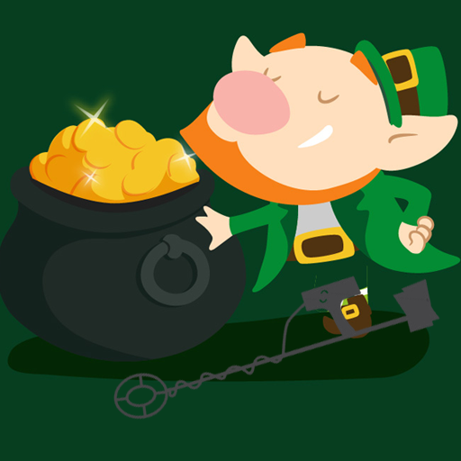
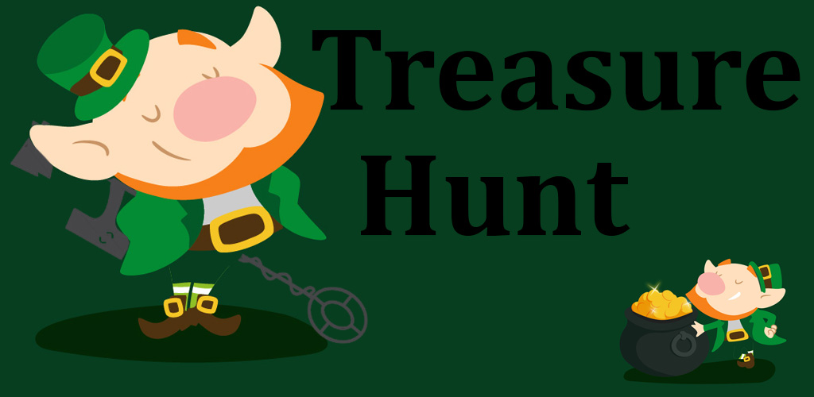
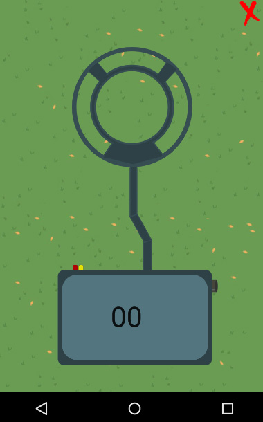

 
 # TreasureHunt

 

Find and collect gold using the sophisticated Gold Detector, the detector is GPS based and will notify you about the gold with Sounds.
Collect Gold and be the richest and quickest leprechaun out there.

##Game Rules
The game contain few stages, in each stage the gold will be further away and harder to find, but more gold can be earned.
The player will try to find the gold using 2 beep sounds that indicates if he is getting closer to the target or far away,
When reached 100 meters from the gold the beep sounds will then play more frequently as getting closer.
Once the player reaches the gold the stage prize gold wil stack up to is total gold

##Project description
https://docs.google.com/document/d/1p7tweNyQ82AGFzjBAiOXwc7VfSLxJ1s8NKo2K5rgIRA/edit?usp=sharing

